# ⚖️ Lawyers Challenge


This project is a small but thought-through **lawyers appointment system**.


---

## :electric_plug: Installation

This project uses a monorepo structure with Yarn workspaces.

1. **Pre‑requisites**: Node.js 20+ and Yarn.
2. Run `yarn` in the repo root to install dependencies.
3. Run `yarn dev` to start both API and web apps.

By default:

- **API** will be available at `http://127.0.0.1:3000`
- **Web** will be available at `http://127.0.0.1:5173`  
  (if the port is taken, Vite will pick another one)

The local database is created automatically as **SQLite** at `./.data/dev.db`.  
You don’t need to configure environment variables to run the demo.

---

## 🧐 Features

- **Time‑zone–aware scheduling**
  - Appointments are stored in **UTC** in the database.
  - The browser’s IANA time zone is detected automatically (fallback to `UTC`).
  - All times are shown in the **user’s local time**.

- **Smart calendar UX**
  - Full‑screen weekly calendar using FullCalendar.
  - Clickable time slots with hover feedback (only on free slots).
  - Existing appointments are clickable and open a detail dialog.
  - Overlap detection prevents creating appointments in an occupied slot.

- **Clean separation of concerns**
  - `apps/api`: Fastify API (Prisma + DB + business rules).
  - `apps/web`: React + Vite SPA for the lawyers UI.
  - `packages/db`: Prisma schema & database utilities.
  - `packages/docs`: architecture notes and diagrams.

- **Robust error handling**
  - Centralized `ApiError` wrapper in the web app.
  - Friendly, localized error messages for common API failures.
  - Clear feedback when time slots are invalid or overlapping.

- **Modern stack**
  - TypeScript everywhere (API + web + shared types).
  - Prisma ORM with a normalized schema for lawyers, calendars, and appointments.
  - Tailwind‑based UI with small, composable components.

---

## 🗄️ Database & Prisma

The default local setup uses SQLite at `./.data/dev.db`.  
The API can also be pointed to PostgreSQL via `DATABASE_URL` if desired.

To (re)generate the Prisma client:

```bash
yarn workspace @challenge/db db:generate
```

This will also generate an **ERD diagram**:



---

## 📚 API & Web Overview

Main API routes used by the web app:

- `POST /api/bootstrap` – creates minimal demo data (lawyer, calendar, etc.)
- `GET /api/lawyers` – lists available lawyers and their calendars
- `GET /api/appointments` – lists appointments for a given lawyer
- `POST /api/appointments` – creates a new appointment (UTC‑backed, time‑zone–aware)

The web client (under `apps/web`) provides:

- A full‑screen appointment calendar.
- A “create appointment” modal with:
  - Automatic time‑zone detection (read‑only for the user).
  - Mode selection and duration.
  - Inline validation and friendly error messages.
- An appointment details modal with:
  - Local date/time.
  - Duration with a clock icon (Lucide).

---

## 🚀 Docker Compose demo

If you have Docker installed, you can run a more “deploy‑like” setup with:

```bash
docker compose up --build
```

This will expose:

- **Web** at `http://127.0.0.1:8080`
- **API** at `http://127.0.0.1:3000`

The API runs with `AUTO_DB_PUSH=1` in Compose so that Prisma applies the schema automatically for demo purposes.

---

👋 That's it!  
