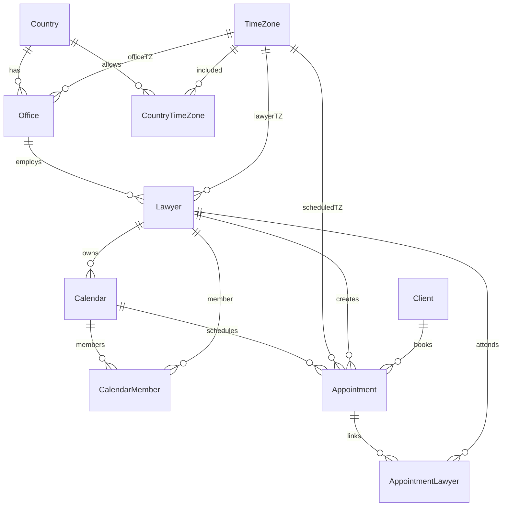

## Modelo inicial de base de datos (propuesta)

### Entidades principales

- **Country**: país (para agrupar oficinas y timezones “válidos”/frecuentes).
- **TimeZone**: zona horaria IANA (ej: `America/Argentina/Buenos_Aires`).
- **Office**: sede/estudio en un país con una zona horaria principal.
- **Lawyer**: abogado (puede heredar la zona horaria de la oficina o tener override).
- **Calendar**: calendario “lógico” (cada abogado puede tener su calendario y además compartir).
- **Appointment**: cita (presencial / videollamada / telefónica).
- **Client** (mínimo): cliente asociado a una cita.

### Relaciones principales (resumen)

- `Country 1—N Office`
- `Country N—N TimeZone` (tabla puente `CountryTimeZone`)
- `Office 1—N Lawyer`
- `Lawyer 1—N Calendar` (owner) + `Lawyer N—N Calendar` (miembros)
- `Calendar 1—N Appointment`
- `Appointment N—N Lawyer` (permite citas con múltiples abogados)
- `Client 1—N Appointment` (simplificado; podría ser N—N si hiciera falta)

### Diagrama ER (Mermaid)

## Estrategia de manejo de zonas horarias

### Principios

- **Guardar instantes en UTC**: `startsAtUtc` / `endsAtUtc` como instantes UTC (tipo `DateTime`).
- **Guardar la zona horaria IANA usada para agendar**: `scheduledTimeZoneId` (ej: `America/Santiago`).
- **Guardar el offset real del instante**: `scheduledOffsetMinutes` para evitar ambigüedades por DST.
- **(Opcional) Guardar wall-clock**: `startsAtLocal`/`endsAtLocal` solo si necesitás auditoría “lo que el usuario escribió”.

### Flujo recomendado al crear una cita

1. El usuario elige `fecha/hora local` + `IANA time zone` (del abogado/oficina o explicitado).
2. El backend convierte a UTC con una librería TZ-aware.
3. Persiste:
   - `startsAtUtc`, `endsAtUtc`
   - `scheduledTimeZoneId`
   - `scheduledOffsetMinutes`
   - opcionalmente `startsAtLocal`, `endsAtLocal`

### Visualización

- Para mostrar en UI: convertir de `startsAtUtc` a la zona horaria del viewer (abogado/oficina/usuario).
- Para “reproducir” el horario original elegido: usar `scheduledTimeZoneId` (+ `scheduledOffsetMinutes` si querés validar DST edge cases).

## Archivo del esquema

El esquema propuesto está en `packages/db/prisma/schema.prisma`.

